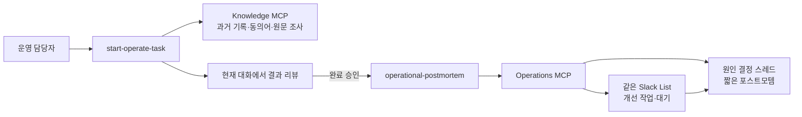
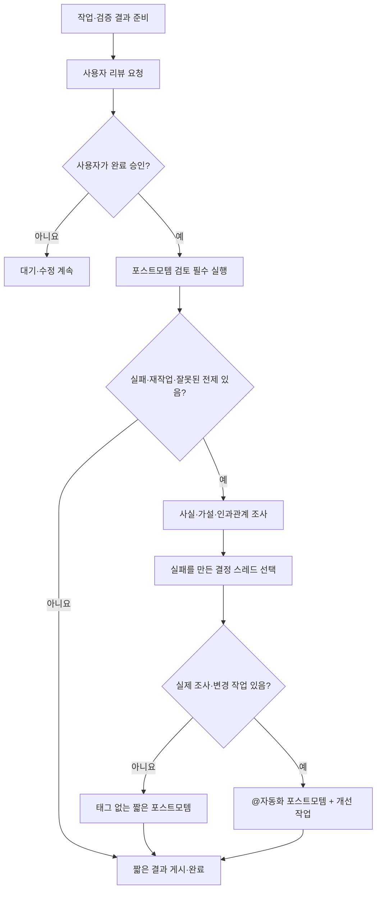

# 분석형 운영 포스트모템 설계

## 목적

운영 작업의 실패를 사실과 가설로 나눠 조사하고, 실패를 만든 결정이 내려진 기존 Slack 스레드에서 실행 가능한 시스템 개선 작업까지 닫힌 고리로 연결한다. 긴 회고 보고서와 별도 포스트모템 채널은 만들지 않는다.

## 핵심 원칙

- 완료 단계마다 포스트모템 **검토**는 실행하지만, 의미 있는 사건이 없으면 글을 쓰지 않는다.
- 포스트모템은 문제가 발견된 곳이 아니라 실패를 유발한 결정이 내려진 곳에 남긴다.
- 요청·전제·작업 생성 실패는 `요청 맥락`, 수행·도구·검증 실패는 `작업 기록` 스레드에 남긴다.
- 양쪽에 원인이 있으면 주된 원인 스레드에 원문을 쓰고 다른 스레드에는 링크만 남긴다.
- 실제 조사·변경 작업이 있을 때만 `@자동화`를 표시하고 개선 작업을 만든다.
- 상태는 Slack List 체크박스의 `대기`와 `완료`뿐이다. 사용자 리뷰와 명시적 완료 승인 전에는 대기다.

## 구성



개선 작업의 `요청 맥락`과 `작업 기록`에는 포스트모템 메시지 permalink를 함께 넣는다. 따라서 작업을 시작해도 새 스레드를 만들지 않고 원래 포스트모템 스레드를 재사용하며, 완료 결과도 같은 스레드에 게시된다.

## 완료 흐름



## 분석 계약

스킬은 게시 전에 다음을 내부적으로 구분한다.

- 확인된 사실과 아직 확인되지 않은 가설
- 기대 결과와 실제 결과
- 실패를 만든 결정부터 결과까지의 인과관계
- 당시 이용 가능했지만 놓친 신호와 선행 조건
- 원인을 밝히기 위한 추가 조사
- 개인의 주의가 아니라 바꿀 수 있는 스킬·검색·워크플로·도구·운영 절차

검색 실패는 하나의 원인이 아니다. 검색 미실행, 표현 불일치, 검색 범위·첨부파일 누락, 권한 문제, 작업 생성 맥락의 원문 링크 누락을 구분해 확인한다. 확인할 수 없는 실행 기록은 단정하지 않고 가설과 조사 작업으로 남긴다.

착수 실패도 별도로 판정한다. 신청자, 운영 방식, 외부 양식, 승인 등 산출물의 필요성과 형태를 결정하는 선행 조건이 없으면 작업을 진행하지 않고 대기로 둔다.

## Slack 출력

고정 장문 보고서가 아니라 값이 있는 항목만 표시한다.

```text
@자동화 [운영 포스트모템] 과거 운영 맥락을 회수하지 못한 채 출결 작업을 시작함

무슨 일이 있었는가:
• 기대: 과거 기수 방식과 현재 운영 확정 여부를 확인한 뒤 필요한 작업만 시작한다.
• 실제: 수기 서명부 기록을 찾지 못했고 신청자도 없는 상태에서 QR 출결 양식을 만들었다.

확인된 원인:
• 현재 작업 생성 맥락에 과거 기수 자료가 연결되지 않았다.

아직 조사할 원인:
• 출석부·입퇴실 서명부 등 동의어 검색이 빠졌는지 확인되지 않았다.

바꿀 시스템:
• 작업 시작 전에 동의어 검색과 착수 조건 확인을 강제한다.

개선 작업: 운영 작업 검색·착수 조건 게이트 개선
변경 대상: start-operate-task와 Knowledge 검색 범위
완료 기준:
• 동의어 검색과 선행 조건 대기 규칙이 스킬과 테스트에 반영된다.

참고 자료:
• <원문 링크>
```

참고 자료는 항상 마지막이다. `검증`, `재사용할 정보` 같은 섹션을 강제로 만들지 않는다.

## Operations MCP 계약

### `publish-operational-postmortem`

- 현재 작업에 연결된 요청 맥락·작업 기록 스레드만 게시 대상으로 허용한다.
- `target_thread_url`에 원문을 게시하고, `related_thread_url`에는 링크만 게시한다.
- 개선 작업 인자가 완전할 때만 봇 멘션과 List 작업 생성을 수행한다.
- 개선 작업 제목, 변경 대상, 가설, 조사 사항, 완료 기준은 포스트모템 원문에 포함되어 새 작업의 요청 맥락이 된다.
- 같은 사건의 `incident_key`로 안정적인 Slack `client_msg_id`를 만들어 재시도 중복을 줄인다.

### `publish_slack_task_result`

- 사용자 완료 승인 뒤에만 호출한다.
- 명시적 승인 확인값 `user_approved_completion=true`가 필수다.
- 상태·검증·재사용 정보·인계 입력을 받지 않는다.
- 결과와 공유 산출물만 게시하고 참고 자료는 마지막 상세 영역에 한 번만 둔다.
- 성공하면 항상 Slack List 체크박스를 완료로 바꾼다.

## 검증 기준

1. 포스트모템 대상은 현재 작업에 연결된 스레드만 허용된다.
2. 주된 원인 스레드에는 원문, 다른 스레드에는 링크만 남는다.
3. 개선 작업이 없으면 `@자동화`와 새 List 행이 없다.
4. 개선 작업이 있으면 같은 List에 미완료 행이 생기고, 요청 맥락·작업 기록이 포스트모템 permalink를 가리킨다.
5. 개선 작업 결과는 원래 포스트모템 스레드에 게시된다.
6. 사용자 승인 전에는 완료 도구를 호출하지 않으며, 선행 조건이 없으면 대기로 둔다.
7. 최종 결과에는 `인계`, `검증`, `재사용할 정보` 고정 섹션이 없고 참고 자료는 마지막에 한 번만 나온다.
8. 모든 MCP 도구는 비동기이며 Slack·DB 동기 작업으로 이벤트 루프를 막지 않는다.

기존 설치본이 호출하는 `record_slack_task_references`는 전환 기간 동안 무기록 호환 도구로 유지한다. Slack에는 쓰지 않고 참고 자료를 최종 `references`에 누적하라고 반환한다.
