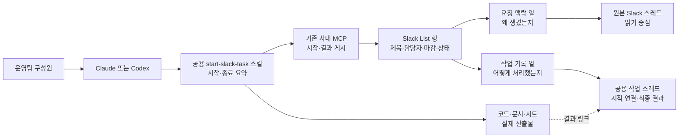
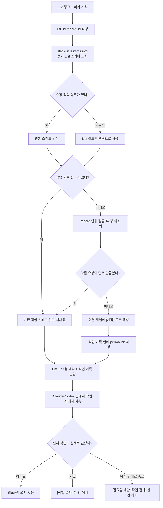

# Slack List의 요청 맥락과 작업 기록을 분리하기

## 한 문장 목적

Slack List 작업 하나에 **왜 생긴 일인지 보여 주는 스레드**와 **실제로 어떻게 처리했는지 보여 주는 스레드**를 따로 연결해, 사람이든 AI든 같은 맥락에서 작업을 이어 간다.

## 핵심 변경

- List 행에 `요청 맥락`과 `작업 기록`이라는 `message` 열을 각각 둔다.
- 기존 `슬랙` 열과 링크는 `요청 맥락`으로 보존한다.
- `이거 작업 시작`은 `작업 기록` 링크가 없을 때만 새 스레드를 만든다.
- 에이전트는 List 필드와 두 스레드를 읽되, 작업 중 대화는 Claude·Codex 안에만 둔다.
- Slack에는 작업이 끝났을 때 **이후에 다시 쓸 결과와 선별한 시행착오·경험 한 건**만 남긴다.
- `agent_task_session`, 중간 체크포인트, 전체 응답 복사 훅, 별도 업무 DB는 만들지 않는다.

작업 ID는 Slack의 `(list_id, record_id)`를 그대로 사용한다.

## List의 두 축

| List 열 | 답하는 질문 | 생성 시점 | 변경 규칙 |
|---|---|---|---|
| `요청 맥락` | 어디서, 왜 만들어졌는가? | Slack 대화에서 작업을 만들 때 | 원본이므로 작업 시작 과정에서 덮어쓰지 않음 |
| `작업 기록` | 실제로 어떻게 처리했는가? | 누군가 `이거 작업 시작`을 실행할 때 | 비어 있을 때 한 번 만들고 이후 재사용 |

- `요청 맥락`은 List에서 직접 만든 작업이면 비어 있을 수 있다.
- `작업 기록`은 하나의 루트 스레드만 가진다. 이미 있으면 Claude와 Codex 모두 같은 링크를 사용한다.
- 두 열 모두 Slack의 `message` 타입이라 List에서 스레드 미리보기를 바로 볼 수 있다.

## 구조 그림 — 데이터와 책임



| 정보 | 단일 원본 |
|---|---|
| 현재 제목·담당자·마감·완료 상태 | Slack List 행 |
| 요청이 생긴 배경과 원래 대화 | `요청 맥락` 스레드 |
| 공유 가치가 있는 최종 결과·경험·결정·남은 일 | `작업 기록` 스레드 |
| 코드·문서·시트 | 기존 저장소 |

## 시작 흐름 — 두 링크를 어떻게 사용하는가



`요청 맥락` 스레드에는 에이전트 진행 로그를 쓰지 않는다. 원래 대화와 실행 기록이 섞이면 두 열을 나눈 의미가 사라지기 때문이다.

## 실제 구현

### 1. 새 List의 열

앞으로 봇이 만드는 List는 처음부터 아래 두 열을 만든다.

```python
CREATE_SCHEMA = [
    {"key": "name", "name": "작업", "type": "text", "is_primary_column": True},
    {"key": "slack_thread", "name": "요청 맥락", "type": "message"},
    {"key": "work_thread", "name": "작업 기록", "type": "message"},
]
```

기존 `slack_thread` key는 호환성을 위해 유지하되 코드에서는 `source_thread` 의미로 다룬다.

### 2. 기존 List 전환

현재 List의 `슬랙` 열과 값은 그대로 `요청 맥락`으로 사용한다. 데이터를 옮기거나 덮어쓰지 않는다.

Slack의 `slackLists.update`는 이름·설명·todo mode만 바꿀 수 있고 일반 열을 추가하는 인자는 없다. 따라서 기존 List에는 운영자가 Slack 화면에서 `message` 타입의 `작업 기록` 열을 한 번 추가해야 한다.

그 뒤 첫 `start_slack_list_task` 호출이 다음을 자동으로 처리한다.

1. `slackLists.items.info` 응답의 `list_metadata.schema`를 읽는다.
2. `message` 타입이면서 이름이 `작업 기록`인 열 ID를 찾는다.
3. `channel_task_list.work_thread_column_id`에 저장한다.
4. 현재 행의 해당 셀이 비어 있으면 작업 스레드를 만든다.

기존 `슬랙` 열의 화면 이름을 `요청 맥락`으로 바꾸는 것은 권장하지만 코드 동작에는 필수가 아니다.

공식 API 근거:

- [slackLists.create](https://docs.slack.dev/reference/methods/slackLists.create/): List 생성 시 `schema`로 `message` 열을 정의할 수 있다.
- [slackLists.items.info](https://docs.slack.dev/reference/methods/slackLists.items.info/): 행과 함께 `list_metadata.schema`를 반환한다.
- [slackLists.update](https://docs.slack.dev/reference/methods/slackLists.update/): 이름·설명·todo mode만 갱신하며 일반 열 추가는 지원하지 않는다.

### 3. `channel_task_list` 변경

새 테이블은 만들지 않고 기존 열 매핑만 확장한다.

```text
thread_column_id
  → source_thread_column_id      기존 값 보존

work_thread_column_id            새 열, 기존 List 때문에 NULL 허용
UNIQUE (list_id)                 List URL에서 연결 채널을 역조회
```

`work_thread_column_id`가 비어 있으면 `items.info`의 스키마로 보충한다. 스키마에도 `작업 기록` 열이 없으면 임의 열에 쓰지 않고 추가 방법을 안내한다.

### 4. 행을 읽는 방식

`start_slack_list_task`는 `slackLists.items.info(list_id, record_id)` 한 번으로 아래를 받는다.

- List의 전체 스키마
- 작업 제목·담당자·마감·완료 여부
- `요청 맥락` 링크
- `작업 기록` 링크

Slack 쓰기 API에는 `message: [URL]`을 보내고, 조회 응답의 `message: [{value: URL}]`는 Service Layer에서 URL 목록으로 정규화한다.

### 5. 작업 스레드 생성

`작업 기록`이 비어 있으면 `channel_task_list`에서 찾은 연결 채널에 다음 루트 메시지를 만든다.

```text
[시작] 교육생 계정 일괄 생성

요청 맥락: <원본 스레드 링크 또는 없음>
Slack List: <현재 record 링크>
기록 방식: 작업 종료 시 결과와 선별한 시행착오·경험 한 건
```

`(list_id, record_id)` 단위 PostgreSQL advisory lock 안에서 행을 다시 읽어 동시 시작에도 하나만 만든다. 생성한 permalink는 `작업 기록` 열에만 쓴다.

## MCP 도구 2개

### `start_slack_list_task`

- 입력: `list_url`
- 출력: List 필드, 요청 맥락 링크·대화, 작업 기록 링크·대화, 생성/재사용 여부
- `작업 기록`이 없을 때만 새 루트 스레드를 만들고 해당 열에 기록한다.

### `publish_slack_task_result`

- 입력: `list_url`, `status`, `summary`, `learnings`, `reusable_findings`, `outputs`, `validation`, `remaining`, `mark_completed`
- `status`: `completed | blocked | handoff`
- 작업 중 대화나 마지막 답변을 복사하지 않고, 다음 사람이 재사용할 수 있는 내용만 구조화해 `[작업 결과]` 한 건으로 만든다.
- List 행의 `작업 기록` 링크를 다시 찾아 그 스레드에만 답글을 단다.
- `mark_completed=true`일 때만 List 완료 체크를 바꾼다.

각 호출이 `list_url`로 대상 행을 다시 찾으므로 `agent_task_session`은 필요 없다.

## 언제 작업 기록에 메시지를 남기는가

| 시점 | Slack 동작 |
|---|---|
| 작업 시작 | 링크를 만들기 위한 `[시작]` 루트 한 번 |
| 에이전트와 대화하며 탐색·수정·의사결정 | 기록하지 않음 |
| 사용자 답변을 기다리지만 같은 작업을 계속할 예정 | 기록하지 않음 |
| 작업 완료 | `[작업 결과]` 한 건 |
| 막혀서 종료하거나 다른 사람에게 넘김 | 인계 가치가 있을 때만 `[작업 결과]` 한 건 |

`final_only` 같은 선택 옵션도 두지 않는다. 이 기능의 목적 자체를 **종료 시 조직 기억 남기기**로 고정한다.

여기서 종료는 에이전트가 답변 한 번을 끝내는 시점이 아니다. 실제 업무가 완료됐거나, 현재 실행을 중단하고 다른 사람이 이어받아야 하는 시점이다. 따라서 매 응답마다 실행되는 Stop 훅에는 연결하지 않는다.

최종 Slack 메시지도 에이전트의 마지막 답변을 그대로 복사하지 않는다. 시행착오는 시간순으로 나열하지 않고, 최종 접근을 바꿨거나 같은 실수를 막아 줄 내용만 0~3개 남긴다. 보통 비자명한 작업에는 1~2개, 단순 작업에는 0개가 적정선이다.

```text
[작업 결과] 교육생 계정 일괄 생성

상태: 완료
결과: 교육생 68명의 계정을 생성하고 로그인 검증을 마침
시행착오·경험:
• 전체 명단을 한 번에 처리하니 승인 대상이 섞여, 승인 여부로 먼저 나눠 진행함
재사용할 정보: 외부 강사 계정은 별도 승인 후 생성해야 함
산출물: <문서·PR·시트 링크>
검증: 샘플 로그인 및 전체 계정 수 확인
남은 일: 외부 강사 12명 승인 대기
```

비밀값, 로컬 절대경로, 내부 추론, 도구 원문은 제외한다.

## 스킬과 MCP 배포

### 결론

스킬과 MCP를 **같은 플러그인에 포함해 함께 설치·업데이트**하는 것은 가능하다. 다만 MCP 서버만 배포했다고 클라이언트의 스킬 파일까지 자동 갱신되는 구조는 아니다.

- MCP 서버 동작: 서버 배포 후 다음 호출부터 반영
- MCP 도구 목록·스키마: 연결된 클라이언트가 MCP를 다시 연결하거나 도구를 새로 고친 뒤 반영
- 스킬의 `SKILL.md`: 플러그인 버전을 올리고 사용자가 플러그인을 업데이트해야 반영
- OpenAI와 Claude: 같은 원본을 쓸 수 있지만 설치 형식과 릴리스는 각각 관리

권장 저장 구조는 하나의 원본 스킬과 두 개의 얇은 매니페스트다.

```text
slack-task-plugin/
├── skills/
│   └── start-slack-task/
│       └── SKILL.md
├── .mcp.json
├── .codex-plugin/
│   └── plugin.json
└── .claude-plugin/
    └── plugin.json
```

릴리스할 때 같은 버전으로 Codex/OpenAI 플러그인과 Claude Code 플러그인을 각각 패키징한다. MCP endpoint는 둘이 공유한다.

중요한 규칙은 스킬 지시문에만 의존하지 않고 MCP 도구 구조에도 고정한다.

- MCP에는 `start`와 `publish result`만 제공하고 중간 기록 도구를 만들지 않는다.
- 서버가 `요청 맥락`에는 쓸 수 없게 하고 `작업 기록`에만 게시한다.
- 서버가 시행착오 최대 3개, 전체 6,000자, 비밀값·로컬 경로 금지 등 최종 메시지의 적정선을 검증한다.

따라서 어떤 사용자의 스킬 업데이트가 늦어져도 중간 대화가 Slack에 쌓이는 동작은 발생하지 않는다.

MCP의 서버 `instructions`에도 "대화는 에이전트 안에 두고 종료 결과만 게시한다"는 원칙을 넣을 수 있다. 다만 이것은 연결 시 제공되는 서버 지침이지 설치형 스킬을 대체하지 않는다. 트리거 문구 인식과 전체 작업 순서는 얇고 안정적인 스킬이 맡고, 실제 쓰기 범위와 메시지 검증은 서버가 맡는다.

공식 문서 근거:

- [OpenAI plugin architecture](https://developers.openai.com/plugins/concepts/plugins): 하나의 플러그인에 skills와 MCP server를 함께 포함할 수 있다.
- [Package and build a plugin](https://developers.openai.com/plugins/build/plugins): `.codex-plugin/plugin.json`, `skills/`, `.mcp.json` 구성과 배포 방식을 설명한다.
- [Build skills for ChatGPT and Codex](https://developers.openai.com/plugins/build/skills): MCP에서 가져온 스킬도 런타임 동기화가 아니라 플러그인 버전의 스냅샷이며 변경 후 다시 스캔·제출해야 한다.
- [Build an MCP server](https://developers.openai.com/plugins/build/mcp-server): MCP 초기화 응답의 `instructions`로 도구 전반의 사용 지침을 전달할 수 있다.
- [Claude Code plugins](https://code.claude.com/docs/en/plugins): Claude 플러그인도 skills와 MCP server를 함께 묶을 수 있다.

## 예외

- List에서 직접 만든 행은 `요청 맥락`이 없어도 시작할 수 있다.
- `요청 맥락` 링크가 삭제됐거나 읽을 수 없으면 해당 항목에 `error`를 담아 경고하고 List 필드로 계속한다.
- 기존 List에 `작업 기록` 열이 없으면 원본 열을 재사용하지 않고 중단한다.
- 이름이 `작업 기록`인 message 열이 둘 이상이면 열 ID를 추측하지 않고 정리를 요청한다.
- `작업 기록`에 링크가 둘 이상이면 어느 것이 기준인지 추측하지 않고 정리를 요청한다.
- 완료된 행을 시작해도 완료 체크를 자동으로 풀지 않는다.
- 등록되지 않은 List면 작업 채널을 추측하지 않는다.
- MCP 사용자가 연결 채널이나 링크 대상 채널을 볼 수 없으면 해당 스레드를 읽거나 쓰지 않는다.
- 비밀값, 로컬 절대경로, 전체 도구 출력, 내부 추론은 스레드에 쓰지 않는다.

## 구현 대상

- `service/slack_task_list.py`: 두 message 열 생성·파싱·읽기·쓰기
- `migrations/knowledge/006_task_list_work_thread.sql`: 기존 열 rename, 작업 열 추가, `list_id` unique
- `app/knowledge_mcp.py` 또는 작은 등록 모듈: MCP 도구 2개
- 공용 `start-slack-task/SKILL.md`: 두 스레드 읽기와 종료 결과·경험 선별
- 플러그인 패키지: 공용 스킬, MCP 연결, Codex·Claude 매니페스트
- 테스트: 새/기존 List, 스키마 발견, 링크 분리, 동시 시작, 완료 상태 보호

## 인터랙티브 시연물

시연물에서 `요청 맥락 있음/없음`과 `작업 기록 비어 있음/기존 기록 있음`을 바꿔 작업을 시작한다. 일반 대화와 시행착오는 즉시 Slack 메시지를 만들지 않고, 작업 종료 때 재사용 가치가 있는 경험만 결과 한 건에 포함되는지 확인한다.

## 검증

1. Slack 대화에서 만든 작업은 원본 링크가 `요청 맥락`에만 들어간다.
2. List에서 직접 만든 작업은 요청 맥락 없이 시작된다.
3. 작업 시작 시 `작업 기록`이 비어 있으면 생성하고, 있으면 재사용한다.
4. 같은 행을 동시에 시작해도 작업 루트와 permalink가 하나만 생긴다.
5. 일반 대화와 중간 결정은 어느 Slack 스레드에도 추가되지 않는다.
6. 기존 `슬랙` 열의 링크는 변경되지 않는다.
7. 기존 List에서 수동 추가한 `작업 기록` 열을 `items.info` 스키마로 발견한다.
8. `mark_completed=false`면 `[작업 결과]`를 남겨도 List 완료 체크는 유지된다.
9. 736px와 360px에서 두 링크 상태별 시연이 정상 동작한다.
10. 플러그인 업데이트 전후에도 MCP 서버는 중간 기록 도구를 노출하지 않는다.
11. 시행착오·경험은 최대 3개이며 비밀값·로컬 절대경로·도구 원문은 거절한다.

## 위험과 판단

- **기존 List에 열을 자동 추가할 수 없음:** 한 번의 수동 열 추가가 필요하다.
- **두 스레드가 다시 섞일 위험:** source 열은 읽기 전용, work 열만 쓰기 대상으로 코드에 고정한다.
- **동시 시작 중 중복 생성:** record 단위 잠금과 잠금 후 재조회로 막는다.
- **에이전트별 기록 기준 차이:** 종료 요약 형식은 공용 스킬에, 쓰기 대상과 도구 범위는 MCP 서버에 고정한다.
- **대화 과잉 수집:** 중간 기록 도구와 매 응답 훅을 만들지 않아 구조적으로 막는다.
- **MCP와 스킬 버전 불일치:** 핵심 안전 규칙은 서버가 강제하고, 스킬은 플러그인 버전으로 함께 릴리스한다.
- **루트 게시 후 List 쓰기 실패:** Slack 게시와 List 셀 갱신은 원자적이지 않다. 이 경우 `[시작]` 메시지의 List 링크로 행을 찾아 수동 연결할 수 있으며, 자동 보정은 실제 장애가 반복될 때 추가한다.

## 구현 승인 기준

1. 기존 `슬랙` 열을 `요청 맥락`으로 정의한다.
2. 새 `작업 기록` message 열을 실제 실행 스레드의 유일한 링크로 사용한다.
3. 기존 List에는 사용자가 열을 한 번 추가하고, 시스템이 `items.info`로 열 ID를 자동 발견한다.
4. 작업 중 대화는 에이전트 안에 두고, 종료 시 결과 요약 한 건만 `작업 기록` 스레드에 남긴다.
5. 스킬과 MCP 연결은 같은 플러그인으로 배포하되 Codex와 Claude 릴리스는 각각 관리한다.

승인 전에는 구현하지 않는다.
