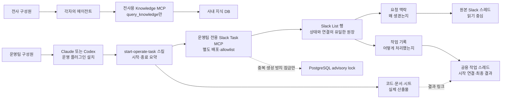
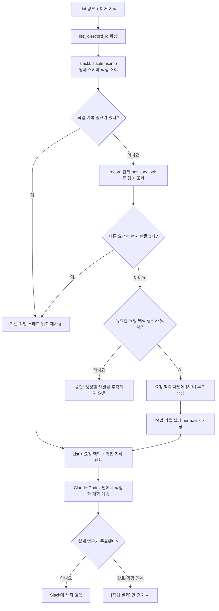

# Slack List의 요청 맥락과 작업 기록을 분리하기

## 한 문장 목적

운영팀 Slack List 작업 하나에 **왜 생긴 일인지 보여 주는 스레드**와 **실제로 어떻게 처리했는지 보여 주는 스레드**를 연결해, 사람이든 AI든 같은 맥락에서 작업을 이어 간다.

## 최종 판단

- Slack List 행이 작업 상태와 스레드 관계의 유일한 원장이다.
- `task_list_work_thread` 같은 별도 테이블이나 `agent_task_session`은 만들지 않는다.
- 이번 PR에서 `migrations/knowledge/006_task_list_work_thread.sql`을 제거한다.
- 새 운영팀 MCP는 기존 `channel_task_list`를 조회하거나 갱신하지 않는다.
- 기존 `channel_task_list`는 Slack 봇이 채널의 새 요청을 어느 List에 넣을지 정하는 예전 라우팅 설정으로만 유지한다.
- PostgreSQL은 같은 행에서 작업 루트를 동시에 두 개 만드는 일을 막는 advisory lock에만 쓴다. 잠금은 관계나 작업 상태를 저장하지 않는다.

작업 ID는 Slack의 `(list_id, record_id)`를 그대로 사용한다.

## Slack List의 두 축

| List 열 | 답하는 질문 | 생성 시점 | 변경 규칙 |
|---|---|---|---|
| `요청 맥락` | 어디서, 왜 만들어졌는가? | Slack 대화에서 작업을 만들 때 | 원본이므로 작업 시작 과정에서 덮어쓰지 않음 |
| `작업 기록` | 실제로 어떻게 처리했는가? | 누군가 작업을 시작할 때 | 비어 있을 때 한 번 만들고 이후 재사용 |

- 두 열은 Slack의 `message` 타입이다.
- `작업 기록`에는 하나의 루트 스레드만 둔다. Claude와 Codex 모두 같은 링크를 사용한다.
- 새 작업 스레드는 첫 번째로 해석 가능한 `요청 맥락` 메시지와 같은 채널에 만든다.
- `작업 기록`이 이미 있으면 `요청 맥락`이 없거나 깨져도 기존 작업을 재개할 수 있다.
- `작업 기록`이 비어 있는데 유효한 `요청 맥락`도 없으면 생성할 채널을 추측하지 않고 중단한다.

## 데이터와 책임



| 정보 | 단일 원본 |
|---|---|
| 현재 제목·담당자·마감·완료 상태 | Slack List 행 |
| 요청이 생긴 배경과 원래 대화 | `요청 맥락` 셀과 그 스레드 |
| 공유할 최종 결과·경험·남은 일 | `작업 기록` 셀과 그 스레드 |
| 코드·문서·시트 | 기존 저장소 |

DB에는 List 행과 두 스레드 사이의 관계를 복제하지 않는다. List 링크만 있으면 `slackLists.items.info`로 스키마와 행을 함께 읽을 수 있기 때문이다.

## 시작 흐름



`요청 맥락` 스레드에는 진행 로그를 쓰지 않는다. 원래 요청과 실행 기록을 섞으면 두 축을 나눈 의미가 사라진다.

## Slack List 스키마

앞으로 Slack 봇이 만드는 List는 처음부터 두 message 열을 만든다.

```python
CREATE_SCHEMA = [
    {"key": "name", "name": "작업", "type": "text", "is_primary_column": True},
    {"key": "slack_thread", "name": "요청 맥락", "type": "message"},
    {"key": "work_thread", "name": "작업 기록", "type": "message"},
]
```

기존 `slack_thread` key는 호환성을 위해 유지한다. 화면 이름이 예전의 `슬랙`이어도 key로 찾을 수 있다.

기존 List에는 Slack 화면에서 `message` 타입의 `작업 기록` 열을 한 번 추가해야 한다. Slack의 `slackLists.update`는 일반 열 추가를 지원하지 않기 때문이다. 첫 시작 호출은 `items.info`의 `list_metadata.schema`에서 열을 직접 찾으며, 열 ID를 DB에 캐시하지 않는다.

공식 API 근거:

- [slackLists.create](https://docs.slack.dev/reference/methods/slackLists.create/): List 생성 시 `schema`로 `message` 열을 정의할 수 있다.
- [slackLists.items.info](https://docs.slack.dev/reference/methods/slackLists.items.info/): 행과 `list_metadata.schema`를 함께 반환한다.
- [slackLists.update](https://docs.slack.dev/reference/methods/slackLists.update/): 이름·설명·todo mode만 갱신하며 일반 열 추가는 지원하지 않는다.

## 운영팀 MCP 동작

### `start-slack-list-task`

- 입력: `list_url`
- List 전체 스키마와 해당 행을 Slack에서 직접 읽는다.
- `작업 기록`이 있으면 새 메시지를 만들지 않고 그 스레드를 재사용한다.
- `작업 기록`이 없으면 advisory lock을 잡고 행을 다시 읽는다.
- 여전히 비어 있으면 첫 유효한 `요청 맥락` 채널에 `[시작]` 루트를 만들고 permalink를 `작업 기록` 셀에 쓴다.
- List 필드, 요청 맥락 대화, 작업 기록 대화, 생성·재사용 여부를 반환한다.

### `publish_slack_task_result`

- 입력: `list_url`, `status`, `summary`, `learnings`, `reusable_findings`, `outputs`, `validation`, `remaining`, `mark_completed`
- Slack List에서 `작업 기록` 링크를 다시 찾아 해당 스레드에만 답글을 단다.
- 작업 중 대화나 에이전트의 마지막 답변을 그대로 복사하지 않는다.
- `mark_completed=true`일 때만 List 완료 체크를 바꾼다.

각 호출이 List URL로 행을 다시 찾으므로 에이전트 세션과 Slack 작업의 연결 테이블이 필요 없다.

## 언제 메시지를 남기는가

| 시점 | Slack 동작 |
|---|---|
| 작업 시작 | 링크를 만들기 위한 `[시작]` 루트 한 번 |
| 탐색·수정·의사결정 | 기록하지 않음 |
| 사용자 답변을 기다리지만 같은 작업을 계속할 예정 | 기록하지 않음 |
| 작업 완료 | `[작업 결과]` 한 건 |
| 막혀서 종료하거나 다른 사람에게 넘김 | 인계 가치가 있을 때 `[작업 결과]` 한 건 |

`final_only` 같은 설정도 두지 않는다. 이 기능의 목적을 **작업 종료 시 재사용할 조직 기억 남기기**로 고정한다. 종료는 에이전트 응답 한 번이 끝나는 시점이 아니라, 실제 업무가 완료됐거나 이번 실행을 중단하고 다른 사람이 이어받아야 하는 시점이다.

시행착오는 시간순 작업 일지가 아니다. 최종 접근을 바꿨거나 같은 실수를 막아 줄 내용만 0~3개 남긴다. 보통 비자명한 작업은 1~2개, 단순 작업은 0개가 적정선이다.

비밀값, 로컬 절대경로, 내부 추론, 도구 원문은 게시하지 않는다.

## 전사용 지식과 운영팀 작업의 배포 분리

| 배포 단위 | 대상 | 노출 도구 | 권한·비밀값 |
|---|---|---|---|
| Knowledge MCP | 전사 | `query_knowledge` | 기존 사내 OAuth, Slack 쓰기 토큰 불필요 |
| Operations Slack Task MCP | 운영팀 | `start-slack-list-task`, `publish_slack_task_result` | 사내 OAuth + 운영팀 이메일 allowlist + Slack bot token |
| TMN Operating Plugin | 운영팀의 Claude·Codex | 두 MCP 연결 + 사내 스킬 | 운영팀에게 설치·업데이트 배포 |

두 MCP는 코드 저장소, 이미지, 공개 도메인과 OAuth 메타데이터를 재사용할 수 있지만 MCP 서버 객체, 경로, 프로세스, 환경 변수, 배포 서비스는 분리한다.

플러그인은 운영팀에게 두 MCP 연결을 한 번에 설치한다. Knowledge MCP는 `https://wfa.codle.io/mcp`, Operations MCP는 `https://wfa.codle.io/mcp/operate`를 사용한다. 공개 도메인과 로그인 흐름은 공유하지만 서로 다른 MCP 엔드포인트이므로 전사 검색과 운영팀 쓰기 권한은 섞이지 않는다.

Knowledge 서비스는 `/mcp`, Operations 서비스는 `/mcp/operate`를 직접 제공한다. Ingress는 같은 `wfa.codle.io` 호스트에서 경로에 따라 두 서비스로 라우팅한다. 두 서비스의 `*_MCP_RESOURCE_URL`은 경로를 제외한 `https://wfa.codle.io`로 두어 공용 `/.well-known/oauth-protected-resource` 메타데이터를 사용한다.

## 예외와 실패 원칙

- `작업 기록`이 없고 유효한 `요청 맥락`도 없으면 새 스레드를 만들지 않는다.
- `작업 기록`이 이미 있으면 깨진 요청 맥락은 `error`와 함께 반환하고 작업 기록은 계속 읽는다.
- `작업 기록` 열이 없으면 원본 열을 대신 쓰지 않고 중단한다.
- 같은 이름의 message 열이나 작업 기록 링크가 둘 이상이면 기준을 추측하지 않는다.
- 완료된 행을 시작해도 완료 체크를 자동으로 풀지 않는다.
- Slack 링크가 가리키는 채널에 봇 권한이 없으면 읽기·쓰기를 시도해 우회하지 않는다.
- Operations MCP의 운영팀 allowlist에 없는 사내 계정은 인증에 실패한다.
- Knowledge MCP에는 Slack 작업 도구와 Slack bot token 의존성이 없다.
- 루트 게시 후 List 셀 쓰기가 실패하면 `[시작]` 메시지의 List 링크로 수동 복구할 수 있다. 자동 보정은 실제 장애가 반복될 때 추가한다.

## 구현 대상

- `service/slack_task_list.py`: 새 List에 두 message 열을 만들되, 기존 채널 라우팅 모델은 유지
- `service/slack_task_thread.py`: List URL만으로 스키마·행·스레드를 읽고 작업 기록을 갱신
- `app/slack_task_mcp.py`: 운영팀 전용 MCP 도구 2개와 allowlist 인증
- `operations_task_main.py`: 운영팀 MCP 독립 진입점
- `plugins/tmn-operating`: 전사 검색·운영 작업 MCP 연결과 사내 스킬
- 테스트: 스키마 직접 발견, 링크 분리, 기존 작업 재사용, 동시 시작, 완료 상태 보호

DB migration은 구현 대상에 없다.

## 검증 기준

1. `migrations/knowledge/006_task_list_work_thread.sql`이 PR에 없다.
2. 운영팀 MCP 코드가 `channel_task_list`를 읽거나 쓰지 않는다.
3. Slack 대화에서 만든 작업은 원본 링크가 `요청 맥락`에만 들어간다.
4. 새 작업 기록은 요청 맥락과 같은 채널에 생성되고 permalink가 `작업 기록`에만 저장된다.
5. 기존 작업 기록이 있으면 요청 맥락이 없어도 같은 스레드를 재사용한다.
6. 새 작업 기록이 필요한데 요청 맥락이 없으면 명확히 중단한다.
7. 같은 행을 동시에 시작해도 작업 루트와 permalink가 하나만 생긴다.
8. 일반 대화와 중간 결정은 어느 Slack 스레드에도 추가되지 않는다.
9. 기존 List의 `작업 기록` 열을 `items.info` 스키마로 발견한다.
10. `mark_completed=false`면 결과를 남겨도 List 완료 체크는 유지된다.
11. 시행착오·경험은 최대 3개이며 비밀값·로컬 경로·도구 원문은 거절한다.
12. Knowledge MCP는 `query_knowledge`만, Operations MCP는 Slack 작업 도구 2개만 노출한다.
13. 736px와 360px 시연에서 요청 맥락 없는 신규 생성은 막히고, 기존 작업 재개는 허용된다.

이 기준을 현재 구현과 배포 검증의 기준으로 사용한다.
