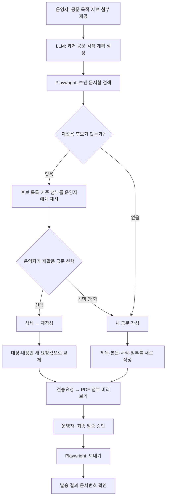

# 문서24 공문 발송 운영 Workflow

## 목적

모든 공문 요청은 **먼저 보낸 문서함에서 재활용할 공문이 있는지 찾는다.** 같은 성격의 공문이 있으면 그 공문을 재작성해 대상과 내용만 바꾸고, 없으면 새 공문을 작성해 본문·서식·첨부파일을 처음부터 준비한다.

LLM은 검색어·공문 초안·변경안을 만들고, Playwright는 로컬 브라우저에서 정해진 화면 이동과 검증만 수행한다. 첫 버전은 한 번에 한 건을 처리한다.

## 참여자와 책임

| 참여자 | 책임 |
| --- | --- |
| 운영자 | 원문 자료를 제공하고, 재활용 후보·초안·최종 발송을 승인한다. 로그인·인증·CAPTCHA도 처리한다. |
| LLM | 현재 요청에서 과거 공문 검색 조건, 재활용 시 변경할 대상·내용, 신규 작성 시 제목·본문·첨부 계획을 구조화한다. |
| Playwright runner | 보낸 문서함 검색, 후보 메타데이터 수집, 재작성 또는 신규 작성, 화면 상태 검증을 결정론적으로 수행한다. |
| 문서24 | 보낸 문서 검색, 재작성, 기관 검색, 웹한글기안기 작성, PDF 미리보기, 실제 대외 발송을 제공한다. |

## 전체 흐름



## 1. 과거 공문 우선 검색

공문을 작성하기 전에 LLM이 현재 요청에서 검색 조건을 만든다. Playwright는 **문서함 → 보낸 문서함**에서 이 조건으로 검색하고, 결과의 문서번호·제목·수신기관·발송일·첨부 유무를 수집한다.

```json
{
  "purpose": "현재 공문을 보내는 업무 목적",
  "recipient": "새로 보낼 기관",
  "sentDocumentSearch": {
    "titleTerms": ["과거 공문을 찾을 제목 핵심어"],
    "recipientTerms": ["기존 수신기관 후보"],
    "dateRange": "필요할 때만"
  },
  "changes": {
    "recipient": "새 수신기관",
    "title": "제목 변경이 필요할 때만",
    "body": "새 본문 또는 본문 변경안"
  }
}
```

검색 결과가 없으면 즉시 신규 작성 경로로 간다. 결과가 하나 이상이면 LLM은 현재 요청과의 관련성을 설명할 수 있지만, **어떤 공문을 재사용할지는 운영자가 후보 목록에서 확정**한다. LLM은 브라우저 요소나 문서번호를 추측해 선택하지 않는다.

## 2. 재활용 경로: 대상과 내용만 교체

운영자가 기준 공문을 선택하면 Playwright는 상세 화면의 **재작성**만 사용한다.

1. 기존 공문의 제목·본문·첨부 목록을 읽어 기준 상태로 기록한다.
2. 받는기관을 새 요청값으로 다시 검색해 선택한다.
3. 제목은 `changes.title`이 있을 때만 교체한다. 본문은 `changes.body`로 전체 교체하거나, LLM이 제공한 명시적 변경안만 적용한다.
4. 기존 첨부·직인·발신자·제출자·문서번호 설정은 기본적으로 유지한다.
5. 다만 미리보기에서 첨부파일이 현재 공문에도 유효한지 운영자가 확인한다. 유지하면 안 되는 첨부가 있으면 운영자가 명시적으로 제거를 지시한다.
6. **전송요청**으로 미리보기를 연다.

이 경로는 이미 검증된 공문의 서식·첨부·발신 설정을 재사용하는 것이 목적이다. 새 공문처럼 첨부파일을 다시 추측하거나 자동으로 바꾸지 않는다.

## 3. 신규 작성 경로: 본문과 첨부를 처음부터 준비

재활용할 공문이 없거나 운영자가 후보를 선택하지 않으면 새 공문을 작성한다.

```json
{
  "kind": "new",
  "sentDocumentSearch": {
    "titleTerms": ["재활용 여부를 먼저 확인할 제목 핵심어"]
  },
  "reuseDecision": "no-reusable-candidate",
  "recipient": "받는 기관 검색어",
  "expectedRecipient": "검색 뒤 화면에 보여야 하는 정확한 기관명",
  "title": "공문 제목",
  "body": "본문",
  "attachments": ["/absolute/path/to/file.pdf"],
  "confirmSubmissionChecks": true
}
```

1. 홈의 **문서 보내기**를 연다.
2. 제출 전 확인 4개가 실제로 모두 충족된 경우에만 `예`를 선택한다.
3. 수신기관을 검색해 정확히 하나의 기관을 선택한다.
4. 제목과 본문을 새로 작성한다. 문서번호 직접입력은 별도 지시가 없으면 사용하지 않는다.
5. 첨부 계획의 모든 파일이 로컬에 있고 총량이 500MB 이하인지 확인해 추가한다. 파일명·개수·용도가 하나라도 맞지 않으면 전송요청 전에 중단한다.
6. **전송요청**으로 미리보기를 연다.

## 4. 결정론적 Playwright 규칙

| 단계 | 규칙 |
| --- | --- |
| 브라우저 | 이미 로그인된 사용자의 로컬 브라우저 탭만 사용한다. |
| 페이지 이동 | 예상 URL·제목을 확인한 뒤 다음 단계로 간다. |
| 요소 선택 | `getByRole`, `getByLabel`, `getByText`, iframe의 `frameLocator`를 우선한다. 좌표·OCR·임의 CSS selector는 사용하지 않는다. |
| 보낸 문서 검색 | 검색 결과의 문서번호·제목·수신기관·발송일이 화면에 보이는 값과 일치할 때만 후보로 제시한다. |
| 기관 선택 | 기대 기관명과 일치하는 결과가 하나일 때만 자동 선택한다. |
| 본문 작성 | 웹한글기안기 iframe을 명시적으로 찾고, 교체 뒤 실제 편집기 값과 미리보기 PDF를 대조한다. |
| 상태 검증 | 버튼 클릭·입력·파일 추가 뒤 URL, 필드값, 파일명, 활성화 상태를 읽어 확인한다. |

## 5. 미리보기·발송·복구

전송요청 팝업의 PDF와 첨부파일 목록에서 수신기관, 제목, 본문 핵심 내용, 첨부파일, 직인·발신자·제출자·문서번호를 확인한다.

대조 결과를 운영자에게 보여 준 뒤에 받은 별도의 최종 승인만 `confirmSend=true`로 넘긴다. `confirmSend=true`가 없으면 **보내기**를 클릭하지 않는다.

- 발송 클릭 후에는 자동 재시도하지 않는다. 먼저 보낸 문서함에서 문서번호·제목·수신기관을 확인해 중복 발송 여부를 판단한다.
- 로그인 만료, 인증서, CAPTCHA, 보안 경고, 기관 검색 결과 복수, 예상과 다른 페이지·팝업은 사용자에게 넘기고 상태를 보존한다.

## PR 구현 범위와 검증

1. 이 workflow 문서
2. `tmn-operating`의 문서24 스킬
3. 보낸 문서함 우선 검색, 후보 제시·선택, 재작성/신규 작성 분기를 구현한 Playwright runner
4. locator·상태 검증·첨부 검증·`confirmSend=false` 발송 차단을 검증하는 테스트

실제 발송을 자동으로 수행하는 통합 테스트는 만들지 않는다. 테스트는 mock 페이지와 미리보기까지의 실행으로 검증하고, 실제 문서24는 운영자가 연결한 세션에서 후보 검색·작성·미리보기까지만 확인한다.
